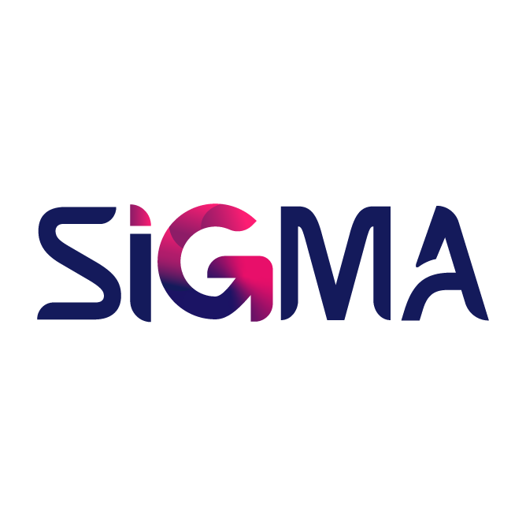

# **SEDIA : Service Desk Incident application**
By PT.SIGMA : System Integration for Global Management Applications

## **Company Profile**

Perusahaan kreatif PT. SIGMA didedikasikan untuk mengembangkan situs web dan aplikasi mobile, untuk mendukung bisnis, startup, dan lembaga-lembaga dalam menghadirkan solusi digital inovatif yang skalabel dan berdampak nyata. Mulai dari ide, desain, pengembangan, hingga peluncuran dan peningkatan berkelanjutan.

PT SIGMA meyakini bahwa teknologi bukan hanya alat, melainkan jembatan yang menyatukan sistem, menyederhanakan kompleksitas, dan menghubungkan dunia.

## **Our Team**

| No | Nama Anggota                    | Role             | Contact                                                                 |
|----|---------------------------------|------------------|-------------------------------------------------------------------------|
| 1  | Audrey Nazhira Ramaniasari      | Project Manager  | [Email](mailto:audreynazhirar@gmail.com) • [LinkedIn](https://www.linkedin.com/in/audreynazhirar/) |
| 2  | Astrid Dewi Maulana R | Secertary       | [Email](mailto:astridrosalina191203@gmail.com) • [LinkedIn](https://www.linkedin.com/in/astriddewimaulanarosalina/)|
| 3  | Zahra Tsabita Nugroho | System Analyst      | [Email](mailto:@gmail.com) • [LinkedIn](https://www.linkedin.com/in/zahratsabita/)|
| 4  | Muhammad Ilham C      | System Analyst     | [Email](mailto:@gmail.com) • [LinkedIn]() |
| 5  | Valentino Rossi       | System Analyst   | [Email](mailto:@gmail.com) • [LinkedIn](https://www.linkedin.com/in/valentino12/)    |
| 6  | Muhammad Rifqi A.       | Backend Developer   | [Email](mailto:rifqiardani267@gmail.com) • [LinkedIn](https://www.linkedin.com/in/muhammad-rifqi-ardani-362a7630b/)     |
| 7  | Ego Widiarto       | Backend Developer   | [Email](mailto:egowidiarto@gmail.com) • [LinkedIn](https://www.linkedin.com/in/ego-widiarto-4894a3230/)   |
| 8  | Mohammad Faiz R.       | Frontend Developer (Website)   | [Email](mailto:@gmail.com) • [LinkedIn](https://www.linkedin.com/in/mohammad-faiz-rakhman-220a632b1/)      |
| 9  | Muhammad Aldi Wijaya       | Frontend Developer (Mobile)   | [Email](mailto:@gmail.com) • [LinkedIn](https://www.linkedin.com/in/muhammadaldiwijaya/)|
| 10  | Burhan Hidayatulloh      | UI/UX Designer   | [Email](mailto:@gmail.com) • [LinkedIn](https://www.linkedin.com/in/burhan-hidayatulloh-2444b5327/) |

## **About Our Project**
### **SEDIA : Service Desk Incident application**

Tujuan dari pengembangan aplikasi ini adalah untuk menyediakan sebuah sistem terpadu yang mampu mengelola insiden dan permintaan layanan teknologi informasi secara lebih terstruktur, cepat, dan transparan. Melalui pemantauan SLA (Service Level Agreement), OLA (Operational Level Agreement), serta laporan kepatuhan yang terukur, aplikasi ini diharapkan dapat meningkatkan akuntabilitas setiap Organisasi Perangkat Daerah (OPD). Selain itu, aplikasi ini juga dirancang untuk mendukung implementasi SPBE (Sistem Pemerintahan Berbasis Elektronik) sebagai upaya mewujudkan transformasi digital di lingkungan pemerintahan daerah.

### **Manfaat & Keunggulan**

Manfaat SEDIA mempercepat penanganan insiden dan permintaan layanan TI di pemerintah daerah melalui sistem terintegrasi. Pengguna dan teknisi dapat melacak status tiket secara real-time, sehingga mengurangi ketidakpastian dan meningkatkan kepercayaan. Proses otomatisasi memungkinkan eskalasi berjenjang, penugasan teknisi yang tepat, serta menjaga transparansi dengan pencatatan SLA dan laporan kepatuhan.

Aplikasi ini mendukung koordinasi lintas unit, penerapan SPBE, dan transformasi digital. Fitur seperti pelaporan via web/mobile/QR Code, mobile offline untuk teknisi, penggabungan tiket, serta enkripsi dan kontrol akses memastikan efisiensi, keamanan data, dan layanan yang terorganisir.

- **Mengikuti Standar ITIL**  
  Memastikan proses layanan sesuai best practice internasional.

- **Eskalasi Cepat & Jelas**  
  Masalah ditangani sesuai tingkat wewenang (Seksi, Bidang, OPD, Kota).

- **Keamanan Data Terjamin**  
  Menggunakan enkripsi, role-based access, serta pencatatan jejak audit sesuai aturan.

- **Dashboard Interaktif**  
  Memudahkan pemantauan tiket, laporan otomatis, dan analisis kinerja teknisi.

- **Sistem Andal & Resilien**  
  Dilengkapi mekanisme backup dan pemulihan cepat saat terjadi gangguan.

- **Akses Fleksibel**  
  Dapat diakses melalui web, mobile app, dan QR Code, mendukung dark mode, serta tampilan yang dapat disesuaikan untuk tiap OPD.
